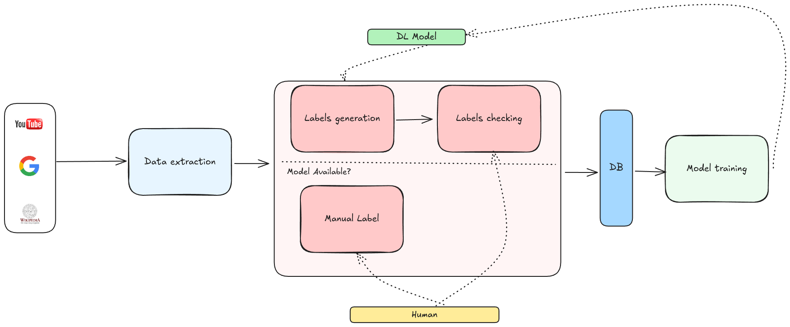

# **Active Learning Pipeline**

This repository contains an active learning pipeline for efficiently downloading, processing, and managing datasets for object detection tasks using YOLO. The pipeline automates tasks such as video downloading, video formatting, frame extraction, label uploading, and dataset organization.

---

## **Table of Contents**
1. [Overview](#overview)
2. [Pipeline Workflow](#pipeline-workflow)
3. [Setup Instructions](#setup-instructions)
4. [Configuration](#configuration)
5. [Execution](#execution)
6. [CVAT Integration](#cvat-integration)
7. [Scheduling Periodic Executions](#scheduling-periodic-executions)
8. [Dependencies](#dependencies)
9. [Troubleshooting](#troubleshooting)
10. [License and Contribution](#license-and-contribution)

---

## **Overview**
The active learning pipeline automates the following:
1. Downloading raw video data from YouTube.
2. Formatting videos for compatibility with further processing.
3. Extracting frames from videos and generating labels using YOLO inference.
4. Uploading the extracted data to labeling platforms (e.g., CVAT).
5. Downloading completed labels from the labeling platform.
6. Cleaning datasets to ensure consistency.

---

## **Pipeline Workflow**
The pipeline consists of the following steps:

1. **Download Videos**: Fetch relevant videos from YouTube based on predefined queries.
2. **Fix Video Format**: Ensure downloaded videos meet the required format for further processing.
3. **Process Videos**:
   - Extract frames from videos.
   - Run YOLO inference to generate labels for object detection.
   - Save processed frames and labels in an organized structure.
4. **Upload Labels**: Send generated data to CVAT for manual refinement and validation.
5. **Download Labels**: Retrieve the manually labeled datasets from CVAT.
6. **Clean Labels**: Remove frames that lack corresponding labels to maintain dataset integrity.



---

## **Setup Instructions**

### **Prerequisites**
1. **Python**: Install Python 3.9 or later.
2. **Dependencies**: Install required libraries from `requirements.txt`:
   ```bash
   pip install -r requirements.txt
   ```
3. **Environment Variables**:
   - Create a `.env` file in the root directory with the following:
     ```env
     CVAT_USER=<Your CVAT Username>
     CVAT_PASSWORD=<Your CVAT Password>
     CVAT_PROJECT_ID=<Your CVAT Project ID>
     MODEL_PATH=<Path to YOLO Model>
     ```

### **Folder Structure**
- **`data/`**: Contains configurations, logs, and datasets.
- **`modules/`**: Contains modular Python scripts for each step in the pipeline.
- **`pipeline.log`**: Stores execution logs.

---

## **Configuration**
The pipeline is configured via `data/config.yaml`. Update the configuration as needed:

```yaml
paths:
  downloads: "downloads"          # Directory to save downloaded videos
  output: "assets/frames"         # Directory to save processed data

youtube:
  queries:
    - "Resumen la liga EA"
    - "Resumen Serie A"
    - "Resumen Bundesliga"
  num_videos: 3                   # Number of videos to download per query
  resolution: "720"               # Video resolution

video:
  framerate: 180                  # Extract one frame every 3 minutes

cvat:
  task_name: "auto"               # Task name ("auto" generates name based on date)
  annotations_format: "YOLOv8 Detection 1.0"

steps:
  download_videos:
    enabled: true
  fix_video_format:
    enabled: true
  process_videos:
    enabled: true
  upload_labels:
    enabled: true
  download_labels:
    enabled: true
  clear_empty_labels:
    enabled: true
```

---

## **Execution**
Run the pipeline using the `main.py` script:

```bash
python main.py
```

### **Step-by-Step Breakdown**
1. **Downloading Videos**:
   - Downloads videos using YouTube queries from the configuration.
   - Tracks downloaded videos to avoid duplicates.

2. **Fixing Video Format**:
   - Converts videos to the required pixel format (`yuv420p`).

3. **Processing Videos**:
   - Extracts frames at regular intervals.
   - Uses YOLO for initial object detection and label generation.
   - Saves frames and labels in the `output` directory.

4. **Uploading Labels**:
   - Uploads the generated frames and labels to CVAT.

5. **Downloading Labels**:
   - Retrieves validated labels from CVAT for further processing.

6. **Cleaning Labels**:
   - Ensures only frames with valid labels are retained.

---

## **CVAT Integration**

### **What is CVAT?**
[CVAT](https://cvat.org/) (Computer Vision Annotation Tool) is an open-source web-based tool for annotating videos and images for computer vision tasks. This pipeline integrates CVAT to streamline the labeling process by automating the following:
1. Uploading extracted frames and initial labels for refinement.
2. Downloading the manually labeled datasets for training models.

### **Using CVAT in the Pipeline**
1. **Upload Labels**:
   - The pipeline creates a CVAT task for the extracted frames and uploads the frames along with YOLO-generated initial labels.
   - **Requirements**:
     - Ensure CVAT credentials (`CVAT_USER` and `CVAT_PASSWORD`) are set in the `.env` file.
     - Define the `CVAT_PROJECT_ID` in `.env` corresponding to the CVAT project where tasks will be created.

2. **Manual Annotation**:
   - Once frames are uploaded, log into the CVAT web interface.
   - Navigate to the created task under the specified project.
   - Refine the labels manually to ensure accuracy.

3. **Download Labels**:
   - After completing annotations, the pipeline downloads the labeled data in the format specified in the `annotations_format` configuration (e.g., `YOLOv8 Detection 1.0`).

### **CVAT Environment Variables**
- **`CVAT_USER`**: Your CVAT username or email.
- **`CVAT_PASSWORD`**: Your CVAT password.
- **`CVAT_PROJECT_ID`**: The ID of the CVAT project where tasks will be created.

### **Steps in CVAT Workflow**
1. **Upload**: The pipeline automatically uploads images and initial annotations to CVAT.
2. **Annotate**: Use CVAT's web interface to refine labels manually.
3. **Download**: The pipeline fetches completed labels, organizing them for further use.

---

## **Scheduling Periodic Executions**
To run the pipeline periodically, use a scheduler like **cron** or **GitHub Actions**.

### **1. Using Cron (Linux/MacOS)**
1. Open the cron editor:
   ```bash
   crontab -e
   ```
2. Add an entry to run the pipeline daily at midnight:
   ```bash
   0 0 * * * /usr/bin/python3 /path/to/main.py >> /path/to/pipeline.log 2>&1
   ```

### **2. Using GitHub Actions**
1. Create `.github/workflows/pipeline.yml`:
   ```yaml
   name: Active Learning Pipeline

   on:
     schedule:
       - cron: "0 0 * * *"  # Run daily at midnight (UTC)
     workflow_dispatch:  # Manual execution

   jobs:
     pipeline:
       runs-on: ubuntu-latest
       steps:
         - name: Checkout repository
           uses: actions/checkout@v4

         - name: Set up Python
           uses: actions/setup-python@v4
           with:
             python-version: '3.9'

         - name: Install dependencies
           run: |
             pip install -r requirements.txt

         - name: Run Pipeline
           env:
             CVAT_USER: ${{ secrets.CVAT_USER }}
             CVAT_PASSWORD: ${{ secrets.CVAT_PASSWORD }}
             CVAT_PROJECT_ID: ${{ secrets.CVAT_PROJECT_ID }}
             MODEL_PATH: ${{ secrets.MODEL_PATH }}
           run: |
             python main.py
   ```

2. Add your secrets in the repository settings under `Settings > Secrets and variables > Actions`.

---

## **Dependencies**
The pipeline uses the following key libraries:
- **yt-dlp**: For downloading videos from YouTube.
- **ffmpeg**: For video formatting and processing.
- **ultralytics**: For YOLO inference and label generation.
- **CVAT SDK**: For interacting with the CVAT API to upload/download annotations.
- **dotenv**: For managing environment variables.
- **yaml/json**: For configuration and logging.

---

## **Troubleshooting**
### **Common Issues**
1. **Missing Dependencies**:
   - Ensure all dependencies are installed using `pip install -r requirements.txt`.

2. **Invalid Configuration**:
   - Verify `config.yaml` and `.env` for correctness.

3. **Access Issues in CVAT**:
   - Check if your CVAT credentials and project ID are valid.

4. **Task Not Found in CVAT**:
   - Ensure that the project ID matches an existing CVAT project.

### **Logs**
Refer to `pipeline.log` for detailed error messages and execution details.

---

## **License and Contribution**

### **License**
This project is licensed under the MIT License. See `LICENSE` for more details.

### **Contributing**
Contributions are welcome! Please follow these steps:
1. Fork the repository.
2. Create a new branch (`git checkout -b feature-name`).
3. Commit your changes and push the branch.
4. Open a pull request.

